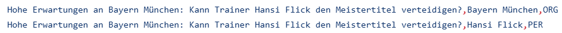
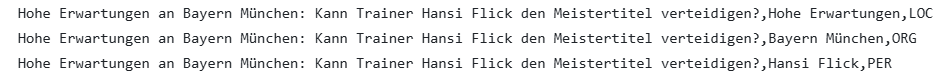
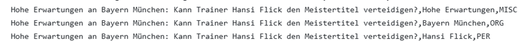

# spacy-stanza-german-ner-comparison
Comparing Named Entity Recognition (NER) on German news titles using spaCy and Stanza

# spacy-stanza-german-ner

Comparing Named Entity Recognition (NER) on German news titles using spaCy and Stanza.

## Project Overview

This project applies and compares two popular NLP libraries, **spaCy** and **Stanza**, for Named Entity Recognition on a dataset of 16,860 German news article titles. The goal is to analyze how each model identifies and classifies entities such as locations, persons, and organizations in German text.

## Dataset

- 16,860 German news article titles from [Jotschi/german-news-titles](https://huggingface.co/datasets/Jotschi/german-news-titles)

## Models Used

| Library | Model |
|---------|-------|
| spaCy   | `de_core_news_sm`, `de_core_news_md`, `de_core_news_lg` |
| Stanza  | `de` pipeline with `tokenize` and `ner` |

## Methodology

1. **Preprocessing** - Extract titles from dataframe and flatten into a list of strings
2. **spaCy NER** - Apply German spaCy pipeline to all titles
3. **Stanza NER** - Apply German Stanza pipeline to all titles
4. **Comparison** - Compare entity extraction across both models using agreement rate and entity overlap

## Entity Types

| Label | Meaning |
|-------|---------|
| `LOC` | Location |
| `PER` | Person |
| `ORG` | Organization |
| `MISC` | Miscellaneous |

## Requirements

```bash
pip install spacy
pip install stanza
python -m spacy download de_core_news_sm
python -m spacy download de_core_news_md
python -m spacy download de_core_news_lg
```

## Usage

Open and run the notebook `ner_comparison.ipynb` in Google Colab or Jupyter.


## Results

The output CSVs contain all extracted entities per model with their type, and can be browsed directly on GitHub.

| File | Description |
|------|-------------|
| [df_spacy_sm.csv](df_spacy_sm.csv) | Entities extracted by `de_core_news_sm` |
| [df_spacy_md.csv](df_spacy_md.csv) | Entities extracted by `de_core_news_md` |
| [df_spacy_lg.csv](df_spacy_lg.csv) | Entities extracted by `de_core_news_lg` |
| [df_stanza.csv](df_stanza.csv) | Entities extracted by Stanza `de` pipeline |

-------------------------

### Comparison of spaCy and Stanza NER outputs

#### Quick insights

Below is an example of stanza correctly extracting Named Entities, as opposed to spaCy models.



The small spaCy model tags *"Hohe Erwartungen"* (high expectations) as LOC



The medium and large spaCy models still erroneously tag *"Hohe Erwartungen"* as a Named Entity, but as MISC



